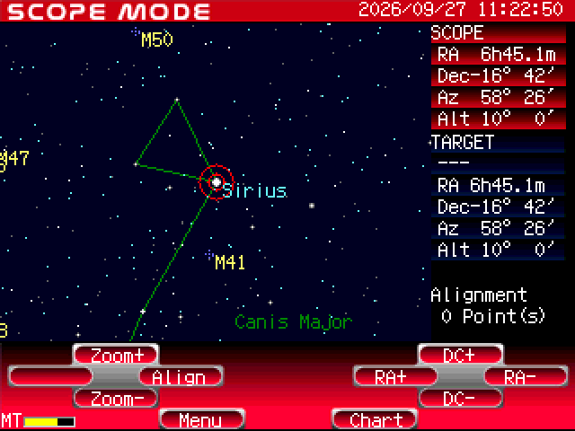

# starbook-bash

Bash control for a **Vixen Starbook (original, fw 2.7B50)** driving a Vixen Sphinx mount, from a Raspberry Pi 5.

The Starbook is controlled only over LAN, through URL commands to its built-in web server
(`GETSTATUS.ASP`, `GOTORADEC?RA=..&DEC=..`, `MOVE`, `STOP`, `SETTIME`, `GOHOME`, `RESET`, ...).
`sb.sh` sends those directly with `curl`, and can also start the INDI driver
(`indi_starbook_telescope`) for KStars/Ekos or PHD2.



*The Starbook's own screen, captured over the LAN with `bash sb.sh screen` after `bash sb.sh star Sirius`.*

## Requirements

Tested on Ubuntu 24.04 (Raspberry Pi 5).

**Required.** Most are already on a standard Ubuntu install:

| Package | Provides | Used for |
|---|---|---|
| `curl` | `curl` | every command sent to the Starbook |
| `gawk` or `mawk` (any awk), `sed`, `grep`, `coreutils` | text handling, `readlink`, `date`, `seq`; awk also formats GoTo coordinates | throughout |
| `procps` | `pgrep`, `pkill` | checking/stopping `indiserver` |
| `iproute2` | `ip` | `indi-start`: checks the adapter's 169.254 address |
| `coreutils` (`base64`, `fold`, `od`) | | `screen`/`watch`: decoding and sending the screen image |

```
sudo apt install curl gawk procps iproute2
```

**Optional: INDI.** The mount does not need INDI: every command that controls it talks to the
Starbook directly over HTTP. INDI is only needed so that **KStars/Ekos or PHD2** can drive the mount,
because those programs only talk through an INDI server.

| Command | Needs INDI? |
|---|---|
| `status`, `settime`, `reset`, `homed` | No |
| `unpark`, `goto`, `star`, `nudge`, `align` | No |
| `park`, `init`, `abort` | No |
| `indi-start`, `indi-stop` | **Yes**, they only start and stop the INDI server itself |

| Package | Provides |
|---|---|
| `indi-bin` | `indiserver`, `indi_getprop`, `indi_setprop` |
| `indi-starbook` | `indi_starbook_telescope` (the Starbook driver) |

```
sudo apt install indi-bin indi-starbook
```

Both are in Ubuntu's `universe` repository; newer builds come from the INDI PPA
(`sudo add-apt-repository ppa:mutlaqja/ppa`). If you use KStars from that PPA
(`kstars-bleeding`) and it fails with `libstellarsolver.so.2: cannot open shared object file`,
install Ubuntu's `libstellarsolver2` alongside the PPA's `libstellarsolver`.

## Setup

- Connect the Starbook through a **USB-Ethernet adapter**. The Pi 5's built-in Ethernet lost
  ~97% of packets with the Starbook's 10BASE-T half-duplex port.
- Give the adapter an address on the Starbook's subnet (the Starbook uses `169.254.1.1/16`):

  ```
  sudo ip addr add 169.254.1.2/16 dev <adapter>
  ```

  Set `IFACE` in `sb.sh` to the adapter's name.

## Usage

```
bash sb.sh <command> [arguments]
```

Run `bash sb.sh` with no arguments to print this list.

**Status and setup** (no motion)

| Command | What it does |
|---|---|
| `status` | Show state (INIT/SCOPE/CHART/USER, and "slewing" during a GoTo), RA/Dec, encoder counts, the Starbook's clock next to the Pi's, firmware, the not-at-home flag, and whether INDI is running |
| `settime` | Set the Starbook's clock from the Pi. Only works in INIT (the startup screen) |
| `reset [-y]` | Reset everything: stop INDI, wait for the Starbook, reset it to INIT, set the clock, clear the not-at-home flag. Asks you to confirm the mount is at home; `-y` skips the question |
| `stars` | List the targets in `stars.txt` |
| `homed` | Confirm the mount is at home after moving it there by hand (clears the not-at-home flag) |
| `unpark` | Leave INIT and enter Scope mode (`START`), then set chart zoom 6. The RA motor starts tracking; nothing slews. Assumes the mount is at home |
| `zoom N` | Set the Starbook's chart zoom: 0 (closest) to 8 (whole sky), 6 is normal. The same setting is the speed of manual moves (`nudge` changes it). No motion |
| `screen [COLS]` | Show the Starbook's screen in the terminal, e.g. over SSH. In terminals with the Kitty graphics protocol (Ghostty, kitty, WezTerm, Konsole) it is the real image, pixel-perfect; elsewhere 24-bit colour half blocks (readable from ~160 columns). Force one with `SB_SCREEN=kitty` or `SB_SCREEN=blocks`. Width defaults to fitting the terminal |
| `watch [SEC]` | Redraw the Starbook's screen every SEC seconds (default 5) as a live view; Ctrl-C quits |
| `init` | Reset to INIT where the mount is: both motors stop. If the mount is more than 1° from home, sets the not-at-home flag |

**Motion** (the mount moves)

| Command | What it does |
|---|---|
| `star NAME` | Slew to a target from `stars.txt` and watch the slew until it arrives; aborts after 180 s. The name is matched without regard to case |
| `goto RA DEC` | Slew to coordinates: RA in hours as `hh:mm:ss`, Dec in decimal degrees, e.g. `goto 00:42:44 +41.2692`. Returns immediately (use `status` to follow it) |
| `nudge N\|S\|E\|W SEC [SPEED]` | Short manual move to centre a star: up to 10 s, speed 1-8 (default 3) |
| `park` | Slew to the home position and watch the slew. Tracking continues at home; follow with `init` to stop the motors |
| `abort` | Stop all motion (slews and manual moves) |

**Alignment**

| Command | What it does |
|---|---|
| `align` | After a GoTo and centring the star (e.g. with `nudge`), tell the Starbook the last GoTo target is now centred. Repeat on 2-4 stars |

**INDI** (only for KStars/Ekos or PHD2)

| Command | What it does |
|---|---|
| `indi-start` | Start the INDI server with the Starbook driver and connect it (then point KStars/Ekos or PHD2 at `localhost:7624`) |
| `indi-stop` | Disconnect and shut down the INDI server |

Commands that slew refuse to run while the not-at-home flag is set (after a power cut during a slew,
or `init` away from home). Move the mount home by hand, then run `homed` or `reset`.

**Star list (`stars.txt`)**

`star NAME` looks targets up in `stars.txt`, next to `sb.sh`. Edit it to add or change targets:
one per line, `NAME  RA  DEC` (J2000), with RA in hours as `hh:mm:ss` and Dec in decimal degrees; `#` starts a comment.

```
# NAME            RA (h:m:s)   DEC (deg)
Vega              18:36:56.3   +38.7836
Andromeda_Galaxy  00:42:44.3   +41.2692
```

Names are one word (use `_` for spaces) and are matched without regard to case. To use a different file: `SB_STARS=/path/to/list.txt bash sb.sh star NAME`.

**Typical session**

```
bash sb.sh reset          # after power-up, mount at home: INIT, clock set, not-at-home flag cleared
bash sb.sh unpark         # enter Scope mode (RA starts tracking, no slew)
bash sb.sh star Vega      # slew to Vega
bash sb.sh park           # back to home
bash sb.sh init           # both motors stop
```

## Starbook behaviour worth knowing

- **Home** is counterweight down with the tube level (Dec 0°, HA ≈ +6h), not pointing at the pole.
- Leaving INIT (`START`) assumes the mount is at home. After a power cut or an `init` away from
  home, move the mount home by hand and run `sb.sh homed`; until then the script refuses to slew.
- In Scope/Chart mode the RA motor always tracks; `STOP` only stops slews. Only `RESET`
  (-> INIT, ~2 min restart) stops both motors.
- The clock resets to 2000-01-01 at every power-up (weak backup battery); `SETTIME` only works in INIT.
  The Starbook refuses GoTos below its horizon (`ERROR:BELOW HORIZONE`), but that check uses its own
  clock, so run `sb.sh reset` or `sb.sh settime` after every power-up before slewing.
- `ALIGN` ignores coordinates and only syncs to the last GoTo target.
- Speed and chart zoom are the same setting (`SETSPEED` 0-8: 0 closest/slowest, 8 whole sky/fastest;
  the Starbook also answers OK to out-of-range values). After a restart the chart is garbled (labels
  stacked on top of each other, no stars) until the first `SETSPEED`; `unpark` sets zoom 6 to fix it.
  `getscreen.bin` returns the 320x240 12-bit screen with no HTTP header (`curl --http0.9`).

## License

MIT, see [LICENSE](LICENSE). The script drives real hardware: use it at your own risk and keep
a hand near the mount's power switch.
